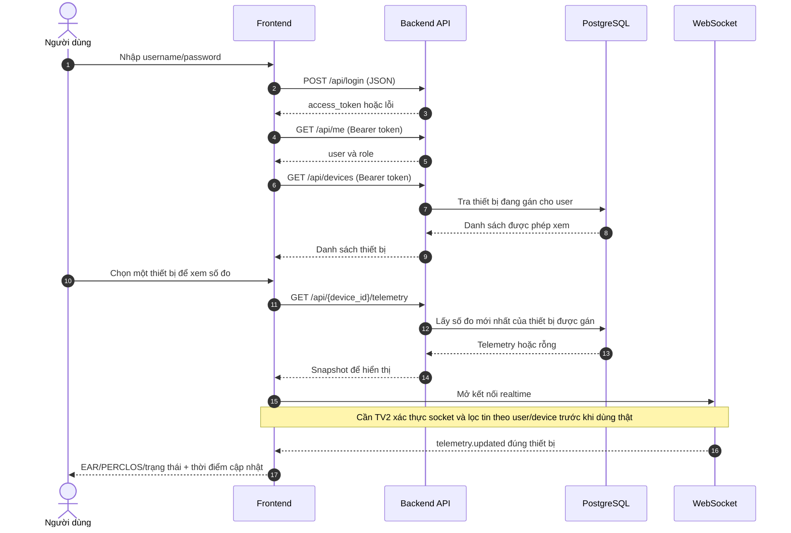
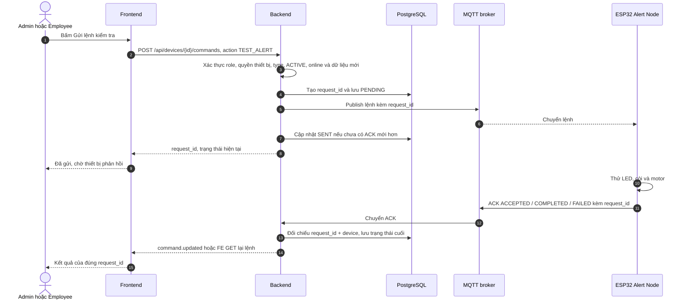
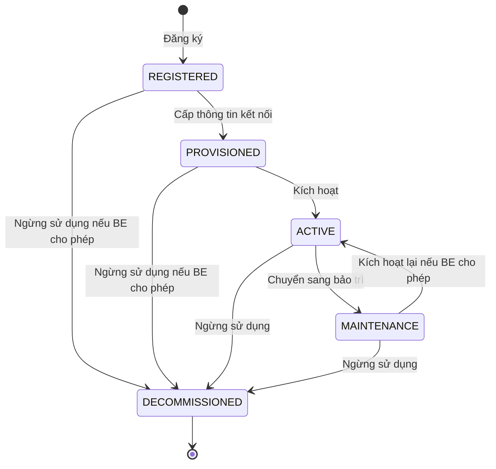

# TV4-21 — Bàn giao FE tuần 2

**Dự án:** Driver Monitoring AIoT Platform

**Phạm vi:** luồng xử lý (sequence), vòng đời thiết bị (lifecycle) và ma trận quyền

**Ngày đối chiếu code:** 08/10/2026
**Người nhận:** TV1 (firmware), TV2 (backend), TV3 (AI), TV4 (frontend)

> **Cách đọc trạng thái:** “Đã có” nghĩa là đã thấy route hoặc logic trong code hiện tại. “FE đã chuẩn bị” nghĩa là màn hình đã gọi API theo hợp đồng tạm, nhưng chưa thể chạy trọn luồng vì BE/firmware chưa cung cấp đủ. Các sơ đồ bên dưới mô tả **luồng cần đạt**, không khẳng định mọi mũi tên đã hoạt động.

## 1. Phạm vi bàn giao nhanh

| Phần | FE hiện có | Phụ thuộc còn lại |
| --- | --- | --- |
| Đăng nhập, kiểm tra phiên | `POST /api/login`, `GET /api/me`; giữ phiên, đăng xuất | BE kiểm tra token và quyền cho mọi API |
| Danh sách thiết bị | `GET /api/devices`, tải/rỗng/lỗi/thử lại | BE chỉ trả thiết bị gán cho user; đang có |
| Chi tiết và vòng đời | Trang chi tiết, nút theo quyền, trạng thái quản lý/kết nối tách riêng | API detail/lifecycle và các trường `type`, `lifecycle_state`, `firmware_version` |
| Kiểm tra cảnh báo và lịch sử lệnh | Form `TEST_ALERT`, theo dõi theo `request_id`, lịch sử | API command, DB command, MQTT publish/ACK, sự kiện WS |
| Cấu hình cảnh báo | Form thời gian bật/tắt LED/còi/rung theo mức 1–3; hiển thị cấu hình đã lưu/thiết bị | GET/PUT config, `config_id`, `applied_config_id`, JSON thống nhất với TV1/TV2 |
| Dashboard AI | Chọn thiết bị, EAR/PERCLOS/trạng thái, xử lý thiếu/cũ dữ liệu | Telemetry hợp lệ có device ID, dữ liệu head pose/face/quality khi TV3 và BE cung cấp |
| Realtime | Một socket chung trong vùng đăng nhập, reconnect, dọn khi logout | WS xác thực, lọc theo thiết bị được gán, BE phát các loại sự kiện |

`id` số trong DB dùng nội bộ để gọi API; giao diện ưu tiên hiển thị `device_code` và tên thiết bị. `device_code` không thay cho việc BE kiểm tra thiết bị có thuộc user đang đăng nhập hay không.

## 2. Sequence — đăng nhập, chọn thiết bị và xem số đo



**Quy tắc FE:** Khi có nhiều thiết bị, Dashboard dùng thiết bị người dùng chọn và chỉ gắn telemetry có đúng `device_id`/`device_code`. Không có mặt thì hiện “Không thấy mặt”; thiếu hoặc cũ dữ liệu thì hiện trạng thái tương ứng, không tự điền ATTENTIVE hay confidence giả. Khi socket nối lại, trang đang mở GET snapshot lại. Bộ lọc FE chỉ để hiển thị; BE vẫn phải kiểm tra quyền với HTTP lẫn WS.

**Tình trạng BE:** `GET /api/devices` đã lọc qua bảng gán `user_device`. `GET /api/{device_id}/telemetry` đã có route, nhưng response schema cần TV2 đối chiếu để trả đúng dữ liệu FE cần. `/ws/telemetry` hiện chưa xác thực kết nối, manager có khả năng broadcast chung, và MQTT consumer chưa phát telemetry qua WS. Chưa dùng WS hiện tại để đưa dữ liệu riêng của khách hàng vào demo nhiều tài khoản.

## 3. Sequence — gửi lệnh kiểm tra cảnh báo và chờ ACK



- HTTP thành công hoặc trạng thái `SENT` chỉ cho biết yêu cầu đã được BE nhận/gửi; **chưa** chứng minh ESP32 đã chạy xong.
- `ACK ACCEPTED` nghĩa là thiết bị nhận/chấp nhận lệnh. Chỉ hiển thị “Thiết bị đã hoàn tất” khi BE ghi `ACKNOWLEDGED` cùng `ack_status=COMPLETED`. `FAILED` và `TIMEOUT` hiện đúng lỗi; FE không tự đặt kết quả cuối.
- FE ghép lịch sử theo `request_id` và thiết bị; ACK đến sớm không bị response `SENT` cũ ghi đè. Refresh lấy lại lịch sử từ DB. Không tự gửi lại POST khi reconnect để tránh lệnh trùng.
- `TEST_ALERT` thử LED, còi và motor trong một lệnh; **không chọn severity**. Mức 1–3 thuộc cảnh báo buồn ngủ/cấu hình theo severity. Thời lượng và JSON hiện là hợp đồng tạm, TV1/TV2 cần chốt.
- TV2 cần cung cấp `POST /api/devices/{id}/commands`, `GET /api/commands`, `GET /api/commands/{request_id}`, lưu DB, MQTT/ACK, và kiểm tra quyền ở server. Các route này chưa có trong BE hiện tại.

## 4. Sequence — đổi cấu hình mong muốn và xác nhận thiết bị áp dụng

```mermaid
sequenceDiagram
    autonumber
    actor U as Admin hoặc Employee
    participant FE as Frontend
    participant BE as Backend
    participant DB as PostgreSQL
    participant MQ as MQTT broker
    participant ESP as ESP32 Alert Node
    FE->>BE: GET /api/devices/{id}/config
    BE-->>FE: desired + applied và mã cấu hình
    U->>FE: Sửa thời gian bật/tắt theo mức 1–3
    FE->>FE: Kiểm tra số nguyên, đơn vị ms, giới hạn
    FE->>BE: PUT /api/devices/{id}/config
    BE->>BE: Kiểm tra role, thiết bị, dữ liệu
    BE->>DB: Lưu desired với config_id mới
    BE->>MQ: Gửi cấu hình cho ESP32
    BE-->>FE: config_id, trạng thái chờ
    FE-->>U: Cấu hình đã lưu; chờ thiết bị áp dụng
    MQ-->>ESP: Chuyển cấu hình
    ESP->>ESP: Áp dụng cấu hình
    ESP->>MQ: Status có applied_config_id
    MQ->>BE: Chuyển status
    BE->>DB: Lưu applied khi ID khớp
    BE-->>FE: config.updated hoặc FE GET lại config
    FE-->>U: Thiết bị đã áp dụng khi hai mã khớp
```

`desired` là **cấu hình đã lưu trên hệ thống**; `applied` là **cấu hình thiết bị xác nhận đang dùng**. Thiết bị offline vẫn có thể có desired mới và applied cũ. Lệnh kiểm tra cảnh báo có thời lượng riêng, nên không dùng lệnh đó để chứng minh cấu hình mặc định đã đổi nếu các tham số riêng ghi đè cấu hình.

FE hiện gọi tạm `GET/PUT /api/devices/{id}/config` và dùng `timings.{led,buzzer,motor}.{1,2,3}.{on_ms,off_ms}`. TV1/TV2 chưa chốt JSON, giới hạn và route thật; hai bên phải thống nhất trước khi đánh dấu phần này PASS.

## 5. Lifecycle — trạng thái quản lý khác trạng thái kết nối



Sơ đồ là **đề xuất tuần 2**; TV2 phải chốt chính xác các chuyển trạng thái hợp lệ, đặc biệt kích hoạt lại sau bảo trì và quyền ngừng sử dụng ở từng trạng thái. BE hiện chưa lưu/trả `lifecycle_state`.

| Trường | Giá trị | Ý nghĩa |
| --- | --- | --- |
| `lifecycle_state` | `REGISTERED`, `PROVISIONED`, `ACTIVE`, `MAINTENANCE`, `DECOMMISSIONED` | Thiết bị đang ở bước quản lý nào |
| `status`/connectivity | `ONLINE`, `OFFLINE`, chưa xác định | Thiết bị còn liên lạc gần đây không |
| `last_seen` | Timestamp hoặc `null` | Lần liên lạc hợp lệ cuối; `null` hiển thị “Chưa ghi nhận” |

Ví dụ `ACTIVE + OFFLINE`: đã được phép hoạt động nhưng hiện mất liên lạc. Heartbeat chỉ cập nhật kết nối và `last_seen`, không tự chuyển thiết bị đang bảo trì về `ACTIVE`. `DECOMMISSIONED` cần BE thu hồi quyền kết nối broker và chặn command/config theo policy. FE không tự cấp credential.

FE đã chuẩn bị các route tạm `GET /api/devices/{id}`, `POST /api/devices`, `POST /api/devices/{id}/{provision|activate|maintenance|decommission}`. BE hiện chỉ có `GET /api/devices`; `Device` hiện chưa có `type`, `lifecycle_state`, `firmware_version`. Vì thiếu `type` và lifecycle, FE chưa thể xác nhận điều kiện để bật nút gửi `TEST_ALERT` cho Alert Node.

## 6. Ma trận quyền FE hiện tại

Role lấy từ `GET /api/me`. Đây là **ma trận tạm đúng với `frontend/src/services/permissions.js`**, dùng tên role BE hiện trả (`Admin`, `Employee`, `Customer`). Chỉ người có quyền mới thấy thao tác tương ứng. TV2 phải áp dụng cùng chính sách ở BE; ẩn nút không ngăn được request thủ công.

| Chức năng | Admin | Employee | Customer |
| --- | :---: | :---: | :---: |
| Xem Dashboard và thiết bị được gán | Có | Có | Có |
| Xem lịch sử lệnh | Có | Có | Có |
| Gửi lệnh kiểm tra cảnh báo | Có | Có | Không |
| Xem cấu hình | Có | Có | Có |
| Sửa cấu hình | Có | Có | Không |
| Đăng ký/provision/activate/maintenance | Có | Không | Không |
| Decommission | Có | Không | Không |
| Xem lịch sử cảnh báo | Có | Có | Có |
| Đánh dấu cảnh báo đã xem | Có | Có | Không |

**Phạm vi dữ liệu:** Customer chỉ được xem thiết bị, telemetry, lệnh và cảnh báo thuộc phạm vi BE cấp cho tài khoản. Admin/Employee cũng phải chịu giới hạn thiết bị theo chính sách BE chốt; role rộng không mặc nhiên có quyền xem dữ liệu của mọi người. BE hiện đã lọc `GET /api/devices` theo bảng gán user-device; các API mới và WS cần áp dụng kiểm tra tương ứng.

**Điểm cần TV2 xử lý trước khi demo nhiều tài khoản:** `POST /api/users` hiện trả danh sách user mà chưa có dependency xác thực; `/ws/telemetry` cũng chưa xác thực. Hai đường này phải được bảo vệ theo quyền đã chốt.

**Hai loại ACK khác nhau:** “Đánh dấu cảnh báo đã xem” là thao tác người dùng trên alert. `ACK COMPLETED` của command là kết quả ESP32 thực hiện lệnh; không dùng một trạng thái để thay cho trạng thái kia.

## 7. Hợp đồng API và sự kiện cần chốt với TV2

| Nhóm | Đã có trong BE | FE đang dùng/chuẩn bị, BE chưa có |
| --- | --- | --- |
| Auth | `POST /api/login`, `GET /api/me` | Cần thống nhất 401/403 và quyền từng route |
| Device | `GET /api/devices` | `GET /api/devices/{id}`, `POST /api/devices`, các POST lifecycle |
| Telemetry | `GET /api/{device_id}/telemetry` | Sửa/khớp response schema; bổ sung metadata AI khi có |
| Command | — | POST command, GET history/detail, DB states và ACK |
| Config | — | GET/PUT config, desired/applied, `config_id` |
| Alert | — | GET alerts, POST acknowledge alert |
| WebSocket | `/ws/telemetry` có kết nối cơ bản | Xác thực, lọc theo quyền, phát event theo thiết bị |

Envelope WS dự kiến: `{ "type": "command.updated", "data": { "request_id": "cmd-001", "device_id": 2, "status": "ACKNOWLEDGED", "ack_status": "COMPLETED" } }`. Các type FE đã chuẩn bị xử lý: `telemetry.updated`, `device.updated`, `command.updated`, `alert.created`, `config.updated`. Cần chốt `device_id` là ID DB hay mã thiết bị ở mỗi topic/payload và thời gian/version để hợp nhất snapshot với event, không ghi dữ liệu cũ đè dữ liệu mới. WS hiện tại chưa xác thực và chưa phát những event này.

## 8. Việc cần xác nhận để nghiệm thu TV4-21 và các mục liên quan

1. **TV2:** Chốt OpenAPI cho device detail/lifecycle, command, config, alert; field role và ma trận quyền server; trả 401/403/404/409/422 có `detail` rõ.
2. **TV2 + TV1:** Chốt `type=ALERT_NODE`, lifecycle, điều kiện online mới, payload `TEST_ALERT`, ACK `ACCEPTED/COMPLETED/FAILED`, timeout và giới hạn thời gian. Thống nhất `COMPLETED` trong ACK firmware khác với trạng thái DB nếu hiện dùng `EXECUTED`.
3. **TV1 + TV2:** Chốt JSON cấu hình thời gian bật/tắt từng đầu ra theo severity 1–3 và cách báo `applied_config_id`. FE sẽ đổi adapter khi hợp đồng chính thức khác cấu trúc tạm.
4. **TV3 + TV2:** Chốt nguồn Vision Node/telemetry, `face_detected`, head pose, confidence/quality và timestamp; không suy đoán giá trị khi thiếu.
5. **TV2 + TV4:** Chốt xác thực WS (cookie/ticket phù hợp trình duyệt), lọc tin theo user-device, các event và cách tải lại snapshot sau reconnect. Test hai Customer khác nhau để chứng minh không nhận dữ liệu của nhau.
6. **Cả nhóm:** Test thiết bị thật: gửi lệnh, quan sát LED/còi/motor, đối chiếu `request_id` và ACK trong DB; đổi cấu hình và thấy `applied_config_id` khớp; refresh vẫn thấy lịch sử. Ghi PASS/FAIL cùng ảnh/video vào mục kiểm thử riêng.

**Nguồn đối chiếu trong repo:** `frontend/src/services/permissions.js`, `frontend/src/services/{devices,commands,config,alerts}.js`, `frontend/src/hooks/useRealtime.js`, `backend/app/api/routes/{users,devices,websocket}.py`, `backend/app/models/device.py`, `backend/app/schemas/{device,telemetry}.py`, `Huong-dan-chi-tiet-TUAN-2-4-thanh-vien-Driver-Monitoring-AIoT.md`.
