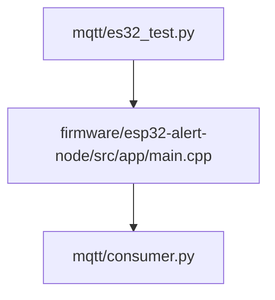
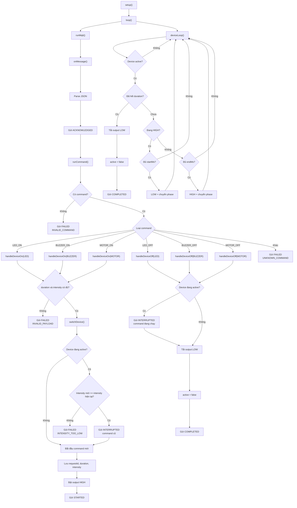

# Luồng hoạt động tổng quát


# Mẫu Topic và Payload
## Nhận ACK COMPLETED (gửi 1 trong 2)
```text
TOPIC: 'driver/alert-01/command'
PAYLOAD:
    {
        "request_id": "cmd-001",
        "device_code": "alert-01",
        "command": "LED_ON",
        "duration": 5000,
        "intensity": "STRONG"
    }
```

```text
TOPIC: 'driver/alert-01/command'
PAYLOAD:
    {
        "request_id": "cmd-001",
        "device_code": "alert-01",
        "command": "LED_OFF"
    }
```
## Nhận ACK FAILED: INVALID_COMMAND
```text
TOPIC: 'driver/alert-01/command'
PAYLOAD:
    {
        "request_id": "cmd-001",
        "device_code": "alert-01",
        "command": null,
    }
```

## Nhận ACK FAILED: UNKNOWN_COMMAND
```text
TOPIC: 'driver/alert-01/command'
PAYLOAD:
    {
        "request_id": "cmd-001",
        "device_code": "alert-01",
        "command": "DO_SOMETHING"
    }
```

## Nhận ACK FAILED: INVALID_PAYLOAD
```text
TOPIC: 'driver/alert-01/command'
PAYLOAD:
    {
        "request_id": "cmd-001",
        "device_code": "alert-01",
        "command": "LED_ON"
    }
```

## Nhận ACK FAILED: INTENSITY_TOO_LOW (gửi 2 cái liên tiếp)
```text
TOPIC: 'driver/alert-01/command'
PAYLOAD:
    {
        "request_id": "cmd-001",
        "device_code": "alert-01",
        "command": "LED_ON",
        "duration": 5000,
        "intensity": "STRONG"
    }
```

```text
TOPIC: 'driver/alert-01/command'
PAYLOAD:
    {
        "request_id": "cmd-001",
        "device_code": "alert-01",
        "command": "LED_ON",
        "duration": 5000,
        "intensity": "WEAK"
    }
```
Theo trình tự ưu tiên: OFF, CONSTANT, STRONG, MEDIUM, WEAK

## ACK mẫu
```text
TOPIC: 'driver/alert-01/ack'
PAYLOAD:
    {
        "request_id": "cmd-001",
        "device_code": "alert-01",
        "status": "FAILED",
        "elapsed_ms": 5000,
        "error": "UNKNOWN_COMMAND"
    }
```
command: LED_ON, LED_OFF, BUZZER_ON,.., MOTOR_ON,..
status: ACKNOWLEDGED, STARTED, COMPLETED, INTERRUPTED, FAILED
error: INVALID_PAYLOAD, INTENSITY_TOO_LOW, INVALID_COMMAND, UNKNOWN_COMMAND

# Luồng hoạt động chi tiết
